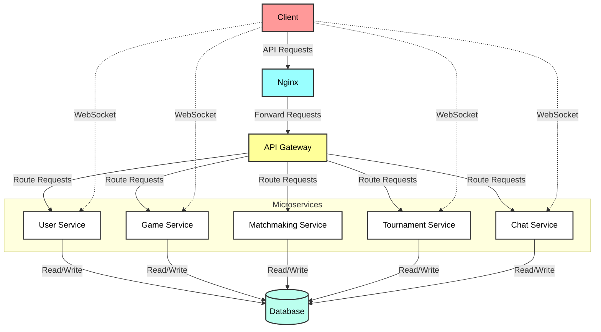

# ft_transcendence ⏳

- Play Ping Pong matches and tournaments, and chat live with your friends!

## Index

- [Index](#index)
- [Technology Stack](#technology-stack)
- [Usage](#usage)
- [Architecture Diagram](#architecture-diagram)
- [DB Diagram](#db-diagram)
- [Supported Features](#supported-features)

# Technology Stack

| Category               | Technology                                                                                                                                                                                                                                                                                                           |
|------------------------|------------------------------------------------------------------------------------------------------------------------------------------------------------------------------------------------------------------------------------------------------------------------------------------------------------------------|
| **Server**             |                                                                                                                                                                                                                      |
| **Backend Framework**  |                                                                                                                                                                                                      |
| **Database**           |                                                                                                                                                                                                      |
| **Containerization**   |                                                                                                                                                                                                                   |
| **Frontend**           |   &nbsp;   &nbsp;   |
| **Authentication**     |   &nbsp;                                                                                                                                        |
| **Languages**          |   &nbsp;  |
| **Development Tools**  |   &nbsp;   &nbsp;   &nbsp;  |
| **Design**             |                                                                                                                                                                                                                      |
| **Libraries**          |   &nbsp;   &nbsp;   &nbsp;  |

---

## Usage

```bash
# to see all available commands
$> make

# starts the services in detached mode and builds the containers if needed
$> make up

# stops and removes all running containers
$> make down

# removes containers, volumes, networks, and restarts everything
$> make re

# cleans up all stopped containers, unused volumes, and networks
$> make clean
```

**After running all the containers, you can access <a href='https://127.0.0.1' target="_blank">https://127.0.0.1</a>**
---

## Architecture Diagram


This diagram illustrates our microservices architecture...

## DB Diagram


# Supported Features

| Feature                                                           | Module                                                                                                                                                | Major/Minor | Supported | Progress |
|-------------------------------------------------------------------|-------------------------------------------------------------------------------------------------------------------------------------------------------|-------------|-----------|----------|
| **[Web](#web)**                                                   |                                                                                                                                                       |             |           |          |
|                                                                   | Use a Framework as backend.                                                                                                                           | Major       | ✅        | Done     |
|                                                                   | Use a front-end framework or toolkit.                                                                                                                 | Minor       | ✅        | Done     |
|                                                                   | Use a database for the backend.                                                                                                                       | Minor       | ✅        | Done     |
| **[User Management](#user-management)**                           |                                                                                                                                                       |             |           |          |
|                                                                   | Standard user management, authentication, users across tournaments.                                                                                   | Major       | ✅        | Done     |
|                                                                   | Implementing a remote authentication.                                                                                                                 | Major       | ✅        | Done     |
| **[Gameplay and user experience](#gameplay-and-user-experience)** |                                                                                                                                                       |             |           |          |
|                                                                   | Remote players                                                                                                                                        | Major       | ✅        | Done     |
|                                                                   | Multiplayers (more than 2 in the same game).                                                                                                          | Major       | ✅        | Done     |
|                                                                   | Game Customization Options                                                                                                                            | Minor       | ✅        | Done     |
|                                                                   | Live chat                                                                                                                                             | Major       | ✅        | Done     |
| **[Cybersecurity](#cybersecurity)**                               |                                                                                                                                                       |             |           |          |
|                                                                   | Implement Two-Factor Authentication (2FA) and JWT.                                                                                                    | Major       | ✅        | Done     |
| **[Server-Side Pong](#server-side-pong)**                         |                                                                                                                                                       |             |           |          |
|                                                                   | Replacing Basic Pong with Server-Side Pong and Implementing an API.                                                                                   | Major       | ✅        | Done     |
| **[Devops](#devops)**                                             |                                                                                                                                                       |             |           |          |
|                                                                   | Designing the Backend as Microservices.                                                                                                               | Major       | ✅        | Done     |

---

# Mandatory Part

## Minimal technical requirement

- Website must be a single-page application. Use the Back and Forward buttons of the browser.
- Compatible with the latest stable up-to-date version of Google Chrome.
- No unhandled errors and no warnings when browsing the website.
- Everything must be launched with a single command line (e.g., `docker-compose up --build`).

[⬆️ Back To Features](#supported-features)

## Game

| Requirement                                   | Description                                                                                        | Implementation                                  |
|-----------------------------------------------|----------------------------------------------------------------------------------------------------|-------------------------------------------------|
| Live Pong game                                | Users play Pong against each other directly on the website using the same keyboard.                | Stack: FrontEnd module                          |
| Remote players module                         | Enables players to compete against remote opponents.                                               | Major: Remote players module                    |
| Tournament system                             | Allows players to compete in a tournament format, displaying matchups and player order clearly.    | Stack: Backend module                           |
| Registration system                           | Players input aliases at the start of each tournament. Aliases reset for new tournaments.          | Stack: Backend module                           |
| Standard User Management module               | Provides user registration, authentication, and profile management.                                | Major: Standard User Management module          |
| Matchmaking system                            | Organizes matchups for participants and announces next fights.                                     | Stack: Backend module                           |
| Adherence to rules                            | All players, including AI, must adhere to the same rules, including identical paddle speed.        | Stack: Backend module                           |
| Frontend development                          | Develop game within default frontend constraints or use a front-end framework/toolkit.             | Minor: Front-End Framework module               |
| Enhanced graphics                             | Option to use advanced 3D graphics for a visually engaging experience.                             | Optional: Graphics module                       |
| Justification for tools                       | Any tools or libraries used for simplification must be justified.                                  | Allowed and recommended; justification required |

[⬆️ Back To Features](#supported-features)

## Security Concerns and Recommendations

| Security Concern                      | Recommendation                                                                                                                                    |
|---------------------------------------|---------------------------------------------------------------------------------------------------------------------------------------------------|
| Password storage                      | Hash passwords before storing them in the database. Use a strong password hashing algorithm.                                                      |
| Protection against SQL injections/XSS | Implement measures to sanitize and validate user input to prevent SQL injections and Cross-Site Scripting (XSS).                                  |
| HTTPS connection                      | Enable HTTPS connection for all aspects of the website. Utilize wss instead of ws for WebSocket connections.                                      |
| Form and user input validation        | Implement validation for forms and any user input, either on the client-side within the base page or on the server-side if a backend is employed. |

# Modules

## Web

### Major Module: Use a Framework as Backend

1. **Framework**: Django
   - **Constraints**: Use Django for backend development.

### Minor Module: Use a Front-End Framework or Toolkit

1. **Framework**: Bootstrap
   - **Description**: Use Bootstrap for responsive and consistent front-end design.

### Minor Module: Use a Database for the Backend

1. **Database**: PostgreSQL
   - **Constraints**: Use PostgreSQL as the database for backend instances, ensuring data consistency and compatibility.

[⬆️ Back To Features](#supported-features)

## User Management

### Major Module: Standard User Management, Authentication, Users Across Tournaments

1. **Features**:
   - Secure user registration and login.
   - Selection of unique display names for tournaments.
   - User information updates.
   - Avatar upload with a default option.
   - Friend addition and online status visibility.
   - User profile displays stats, such as wins and losses.
   - Match history for 1v1 games with dates and relevant details.

[⬆️ Back To Features](#supported-features)

### Major Module: Implementing Remote Authentication

1. **Authentication System**: OAuth 2.0 with 42
   - **Objectives**:
     - Integrate OAuth 2.0 authentication system for secure sign-in.
     - Obtain necessary credentials and permissions from the authority.
     - Implement user-friendly login and authorization flows.
     - Ensure secure exchange of authentication tokens and user information.

[⬆️ Back To Features](#supported-features)

## Gameplay and User Experience

### Major Module: Remote Players

- **Description**: Allows two distant players to access the same website and play the same Pong game. Handles network issues like disconnection or lag to ensure the best user experience.

### Major Module: Multiplayers (More Than 2 in the Same Game)

- **Description**: Allows multiple players (more than 2) in a single game session.

### Minor Module: Game Customization Options

- **Description**: Provides customization options for games on the platform.
- **Key Features**:
  - Offer customization options like power-ups, attacks, or different maps.
  - Allow a default version for simpler gameplay.
  - Ensure options are available and consistent across games.
  - Provide user-friendly settings menus for adjustments.

### Major Module: Live Chat

- **Description**: Implements a chat system for user interaction.
- **Key Features**:
  - Direct messaging and user blocking.
  - Game invitations through chat.
  - Notifications for upcoming games in tournaments.
  - Access to player profiles from the chat interface.

[⬆️ Back To Features](#supported-features)

## Cybersecurity

| Module Type | Description                                                                                          | Key Features                                                                                                    |
|-------------|------------------------------------------------------------------------------------------------------|-----------------------------------------------------------------------------------------------------------------|
| Major       | **Implement Two-Factor Authentication (2FA) and JWT**                                                | - Introduce Two-Factor Authentication (2FA) for enhanced security.                                              |
|             |                                                                                                      | - Utilize JSON Web Tokens (JWT) for secure authentication and authorization.                                    |
|             |                                                                                                      | - Offer a user-friendly setup process for enabling 2FA.                                                        |

[⬆️ Back To Features](#supported-features)

## Server-Side Pong

### Major Module: Replacing Basic Pong with Server-Side Pong and Implementing an API

- **Description**: Replaces the basic Pong game with a server-side version and includes an API.
- **Key Features**:
  - Develop server-side logic for gameplay.
  - Create an API for game initialization, player controls, and game state updates.
  - Integrate with the website for direct access.

[⬆️ Back To Features](#supported-features)

## DevOps

| Module Type | Description                                                                            | Key Features                                                               |
|-------------|----------------------------------------------------------------------------------------|----------------------------------------------------------------------------|
| Major       | **Designing the Backend as Microservices**                                             | - Divide the backend into smaller, loosely-coupled microservices.          |
|             |                                                                                        | - Define clear boundaries and interfaces for independent development.      |
|             |                                                                                        | - Implement RESTful APIs for communication between services.               |

[⬆️ Back To Features](#supported-features)
